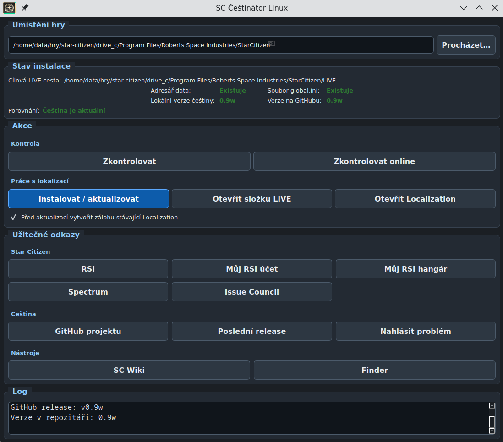

# SC Češtinátor Linux


Linux GUI nástroj pro instalaci a aktualizaci české lokalizace pro hru Star Citizen.

## Stažení

👉 **[Stáhnout AppImage](https://github.com/1walkerit/sc-cestinator-linux/releases/latest)**

Stačí stáhnout soubor, nastavit práva a spustit:

```bash
chmod +x SC-Cestinator-Linux-v0.1.0-x86_64.AppImage
./SC-Cestinator-Linux-v0.1.0-x86_64.AppImage
```

## Co aplikace umí

* výběr cesty ke hře
* kontrolu složky `LIVE/data/Localization/english/global.ini`
* zjištění lokální verze češtiny
* zjištění online verze češtiny z GitHubu
* instalaci a aktualizaci české lokalizace
* otevření složek `LIVE` a `Localization`
* vytvoření zálohy stávající lokalizace před aktualizací
* otevření užitečných odkazů pro Star Citizen a českou lokalizaci

## Aktuální stav

Aktuálně aplikace podporuje větev:

* `LIVE`

Podpora dalších větví, například `PTU` nebo `EPTU`, může být doplněna později.

## Screenshot



## Spuštění

```bash
python -m venv .venv
source .venv/bin/activate
pip install -r requirements.txt
python app.py
```

## Požadavky

* Linux
* Python 3
* PySide6

## Poznámka

Aplikace je určena pro Linux a vznikla jako jednoduchý nástroj pro pohodlnou správu české lokalizace hry Star Citizen.
